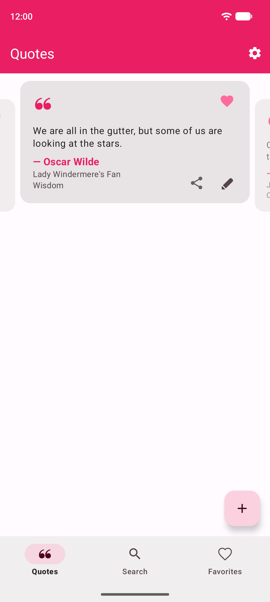
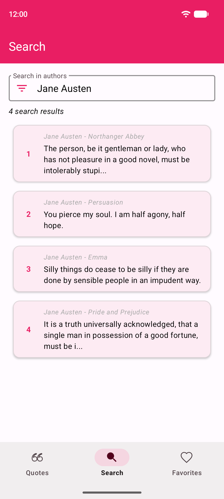
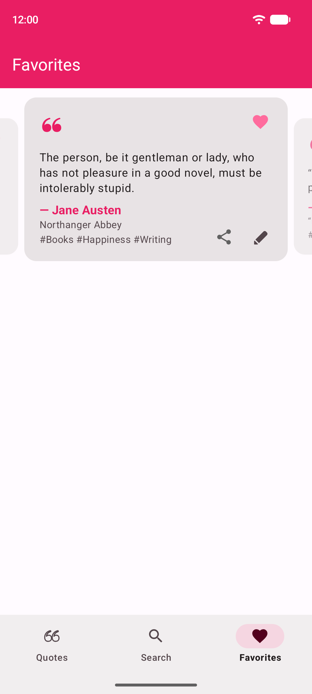
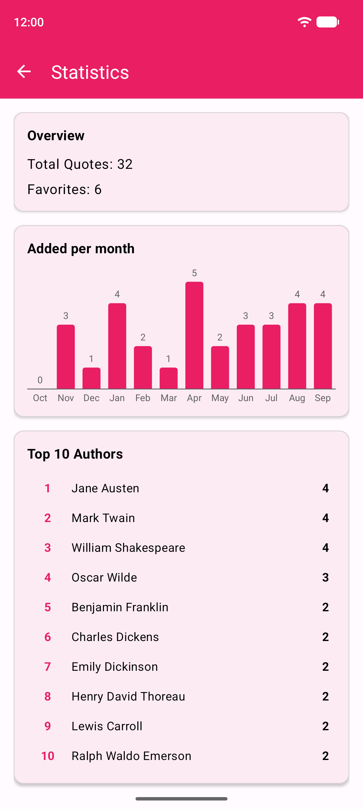
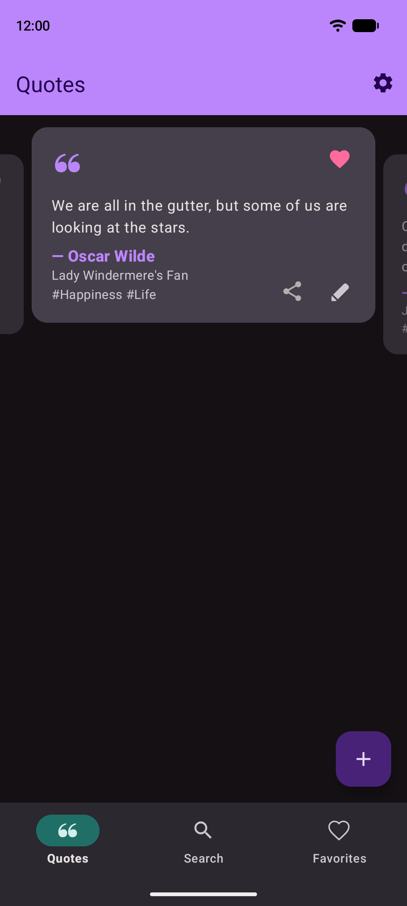

# MyQuotes

[](https://github.com/robert-crump/MyQuotes/actions/workflows/android.yml)

Your personal quote collection, one swipe at a time.

<table>
  <tr>
    <td></td>
    <td></td>
    <td></td>
    <td></td>
    <td></td>
  </tr>
</table>

- **Swipe** through your quotes in shuffled order
- **Favorite** the ones that stay with you
- **Search** by text, author, source or category
- **Daily quote** notification in the afternoon
- **Statistics** on your collection
- **Back up** automatically to a local folder or Google Drive, or export and import a file
- **Light and dark** theme

<sub>Screenshots use public-domain demo quotes; regenerate with `./gradlew readmeScreenshots` (needs a running emulator).</sub>

## Build

Requires Android 14+ (API 34) and Android Studio Meerkat or later.

```bash
git clone https://github.com/robert-crump/MyQuotes.git
```

Open in Android Studio and run. The app starts empty: add quotes or import a backup in Settings.

Built with Java, AndroidX, WorkManager and Material Design 3. Developed with [Claude Code](https://claude.ai/code).
